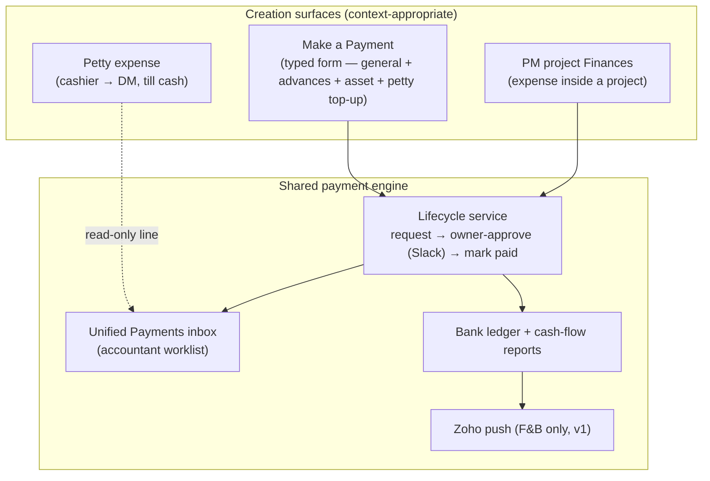
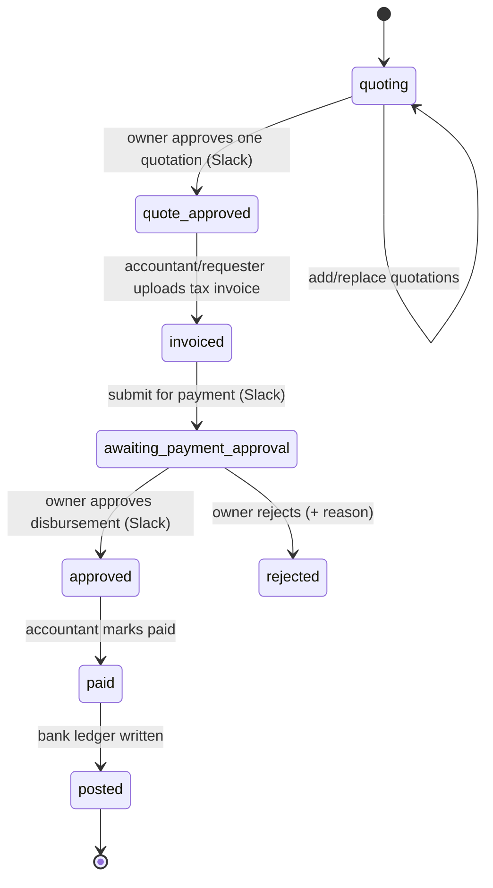

# Payments — Unified Workflow Design

*Consolidates pipeline #16 (petty Slack), #18 (PM finance flow), #23 (all-payment
Slack approvals + payee/bank dropdown + Zoho push) and #24 (typed "Make a Payment"
form). Drafted 2026-06-29. Status: **design agreed — ready for UI/UX (Claude Design)
then build (Claude Code).** Nothing built yet beyond what already ships (petty,
payment_requests, PM expenses).*

---

## 1. Purpose & scope

Today the same motion — *raise a payment → get it approved → pay it → reconcile it* —
lives in three disconnected places, each with its own screen and its own "is it paid
yet" state:

- **Petty expenses** — till cash, cashier → daily-manager approve, reconciled at the
  day's closing. (`petty_expenses`)
- **General payments** — accountant raises with a receipt, owner/manager approve,
  accountant marks paid against a bank account. (`payment_requests`)
- **PM project expenses** — full quotation → approval → invoice → payment lifecycle,
  one per project, surfaced only inside each project's Finances tab.
  (`project_expenses` / `project_quotations`)

The accountant is already the common actor across the latter two, but has to tour
multiple surfaces to answer "what's pending owner approval?" or "what did we pay this
week?". **This design gives them one workspace, one creation form, and one
money-out lifecycle — without a destructive merge of genuinely different flows.**

In scope for v1: the unified **Payments** module (inbox + typed creation form +
shared approval/Slack/ledger service), advance handling, and an F&B-scoped Zoho push.
Out of scope for v1: an in-console Slack chatbox, AI invoice extraction (pipeline #19,
a natural fast-follow), and a full table merge.

---

## 2. Design decisions (locked 2026-06-29)

| # | Decision | Choice |
|---|---|---|
| D1 | Consolidation depth | **One shared engine + unified inbox.** Keep source tables; consolidate at the workflow + UI layer. Petty and PM stay specialized *feeders*. |
| D2 | Approval mechanism | **Interactive Slack Approve/Reject buttons replace the OTP.** Console maps the clicking Slack user → `authorized_users` and records who approved. |
| D3 | Approval authority | **Owner approves every payment.** No threshold delegation. (The ₹5,000 manager threshold is retired for approval.) |
| D4 | Quotation stage | **Required only for asset purchases.** Routine/opex payments skip it. PM projects keep their own quote flow. |
| D5 | Asset approval count | **Owner approves twice** — the quotation (locks vendor + price), then the disbursement. |
| D6 | Zoho push (v1) | **F&B supplier payments only**, posted as paid on mark-paid. |
| D7 | Petty-cash float top-up | **A payment type in "Make a Payment"** — all money leaving the bank is created in one place. (Distinct from petty *expenses*, which stay in the closings flow.) |
| D8 | Vendor-advance netting | **Auto-suggest, accountant confirms.** Many advances may net against one final payment; partials allowed. Proforma optional (vendor-only match when absent). |
| D9 | Distributor share advance | **Per distributor, per movie, auto-net** off the console-computed settlement — no accountant confirmation. |

---

## 3. Actors & roles

| Actor | Global role | Does in this flow |
|---|---|---|
| **Accountant** | `accountant` | The primary operator. Raises payments, manages advances, marks paid, reconciles to the bank ledger. Owns the unified inbox. |
| **Owner** | `owner` | Approves **every** payment (and every asset quotation) via Slack buttons. |
| **Manager** | `manager` | May raise a general payment; cannot approve (D3 removes the manager threshold). |
| **Project member (PM/DM)** | project `project_manager` / `member` | Raises and invoices PM project expenses, which then surface in the same inbox. |
| **Cashier / Daily-manager** | `cashier` / `daily_manager` | Unchanged — the petty-expense till flow stays as-is; appears read-only in the inbox. |

Payee selection draws on the existing catalogs — `distributors` (with film links) and
`parties` (`vendor` / `customer` / `employee` / `other`, plus free-form `category` and
stored `account_last4` / `ifsc`). "Paid from" draws on `bank_accounts`.

---

## 4. The consolidation model

**Consolidate the queue and the lifecycle, not the storage.**

- **General + PM payments share one lifecycle.** PM keeps its project/quotation context
  at *creation*; the instant an expense is ready to pay it appears in the *same*
  accountant queue with the *same* Approve-in-Slack and Mark-paid actions. The
  accountant stops touring project pages.
- **Petty expenses stay their own till-cash flow** (small cash, reconciled to the day's
  closing, no bank disbursement) but get a **read-only line in the inbox** for
  visibility. They are never forced into the bank-payment machine.
- **Petty-cash float top-up** (bank → till) *is* created in "Make a Payment" as a payment
  type (D7), because it is money leaving the bank.

Why not a full table merge: it would flatten till-cash reconciliation and project
quotation context, is a heavy/risky migration, and delivers no accountant-visible
benefit over a shared inbox.

---

## 5. Payment-type taxonomy

Each type carries flags that drive the flow and the books: `invoice_rule`
(required / exempt / settlement-backed), `is_asset` (→ forces quotation), and the
`accounting_head` (Zoho/Tally posting target + cash-flow report grouping). Owner-editable
in Settings.

| # | Payment type | Payee category | Invoice rule | Asset → quotes | Accounting head |
|---|---|---|---|---|---|
| 1 | Distributor share remittance | Distributor | Settlement-backed¹ | No | Distributor share (COGS) |
| 2 | Distributor advance / MG | Distributor | Exempt (advance²) | No | Advances to distributors |
| 3 | Publicity & marketing | Vendor | Required | No | Publicity expense |
| 4 | F&B / concession stock | Vendor (F&B supplier) | Required | No | F&B purchases (COGS) — **Zoho push** |
| 5 | Maintenance & repairs | Vendor | Required | No | Repairs & maintenance |
| 6 | Equipment / asset purchase | Vendor | Required | **Yes** | Fixed assets (capex) |
| 7 | Renovation / project capex | Vendor | Required | **Yes** | Capital WIP → fixed assets³ |
| 8 | Utilities (power, water, net, DTH) | Vendor / utility | Required (bill) | No | Utilities |
| 9 | Rent / lease | Landlord | Exempt (advance²) | No | Rent |
| 10 | Salaries & wages | Employee | Exempt | No | Salaries & wages |
| 11 | Statutory dues (GST, PF/ESI, taxes, licences) | Government / statutory | Exempt (challan) | No | Statutory dues |
| 12 | Professional fees (CA, legal, audit) | Vendor | Required | No | Professional fees |
| 13 | Software & subscriptions | Vendor | Required | No | Software / subscriptions |
| 14 | Bank charges / loan EMI / interest | Bank / financial | Exempt | No | Finance costs |
| 15 | Petty-cash top-up | Internal (own till) | Exempt | No | Petty cash float⁴ |
| 16 | Miscellaneous | Vendor / other | Required | No | Sundry expenses |

¹ **Settlement-backed:** not a vendor bill. The payable comes from the console's
Picture-Ending settlement for the film; the accountant attaches that statement instead of
an invoice. Open call (§13-a): whether this type is *created* in Make-a-Payment or
*initiated from the box-office settlement* and merely posts to the same ledger.
² **Advance (exempt):** paid before/without a final bill; reconciled later (see §8).
³ Originates in the PM module (project budget line → expense); surfaces here to be paid.
⁴ Bank → till transfer (D7); funds the float that cashiers draw petty expenses from.

---

## 6. Lifecycle / state machines

### 6.1 Routine payment (opex, non-asset)

```mermaid
stateDiagram-v2
  [*] --> draft
  draft --> awaiting_approval: submit (posts to Slack #payments)
  awaiting_approval --> approved: owner clicks Approve in Slack
  awaiting_approval --> rejected: owner clicks Reject (+ reason)
  rejected --> draft: revise & resubmit
  approved --> paid: accountant marks paid (bank account + reference)
  paid --> posted: bank ledger written; F&B → Zoho
  posted --> [*]
```

Invoice attached at `draft` unless the type's `invoice_rule = exempt`.

### 6.2 Asset purchase (capex — two owner approvals, D4/D5)

Invoice subtotal must match the approved quotation; **GST + freight** are the only
permitted additions (carried over from the PM flow). A deviation is flagged with a
required reason. An optional **quote-skip floor** (Settings) lets trivial asset buys below
₹X skip the quotation stage.

### 6.3 Advance payment

An advance is the routine flow (§6.1) with `is_advance = true` and a **link target** set,
followed by later netting (§8). It still requires owner approval to go out.

---

## 7. Slack approval mechanics (D2)

Reuses and generalises the proven petty-expense mechanism (cash_21:
`notify-slack` + `slack-interactions` Edge Functions, bot token + Block Kit + `chat.update`).

- On **submit**, the engine posts a Block Kit card to **#payments**: payment type, payee,
  amount (+ invoice/quote file), a console deep-link, and **Approve / Reject** buttons.
  Asset quotations post a parallel card with **Approve quotation / Reject**.
- The interactivity request hits `slack-interactions`, which verifies the Slack signing
  secret, maps `payload.user` → `authorized_users` (via a stored `slack_user_id`, added
  to the users catalog), checks the mapped user is the **owner**, calls the matching
  SECURITY DEFINER transition RPC, and edits the card in place (`chat.update`) to
  "Approved by …" / "Rejected by … — reason".
- **Authorisation rule:** only the owner's Slack identity can drive an approval. A click
  from any other mapped user is refused with an ephemeral Slack reply.
- Staging and prod use **separate Slack apps/channels** via per-environment secrets
  (`SLACK_PAYMENTS_WEBHOOK_URL`, `SLACK_BOT_TOKEN`, `SLACK_SIGNING_SECRET`).

---

## 8. Advances & reconciliation

### 8.1 Distributor / share advances (console-aware, D9)

Tagged to **movie + distributor**. Because the console computes the distributor's share
from the DCR (Picture-Ending settlement), a share advance **auto-nets** against that
film's final share remittance the moment the settlement is computed — no accountant
confirmation. The accountant sees "advance ₹X paid, balance due ₹Y" on the remittance.

### 8.2 Vendor advances (proforma-driven, D8)

No console-computed amount, so the link is **proforma invoice (optional) + vendor**:

1. Accountant raises an advance, optionally attaching a **proforma invoice** (a
   first-class artifact, distinct from the final tax invoice).
2. When the final tax invoice arrives, the console **auto-suggests** the vendor's
   outstanding advances (matched on proforma where present, vendor otherwise).
3. The accountant **confirms** which advances to net; the final payable is reduced.
   Many advances may settle one final payment; partial settlement is allowed.

### 8.3 Outstanding-advances view

A dedicated view lists **unrecovered advances by distributor and vendor** — the thing the
accountant expects. Accounting-wise an advance posts to *Advances to
distributors/vendors* and **reclasses** to the real expense head when the final bill lands
and nets.

---

## 9. The accountant inbox (for Claude Design)

The centrepiece UX. A single worklist of everything needing a payment action, regardless
of origin.

- **Columns:** payee, type, amount, source (General / Project X / Petty), status, age,
  needed-by.
- **Status lanes / filters:** Drafts · Awaiting owner approval · Approved — ready to pay ·
  Paid · (read-only) Petty.
- **Row actions** are state- and role-aware: submit, mark paid (bank account + reference),
  open the Slack card, net an advance.
- **Quick views:** *Outstanding advances* (§8.3); *Paid this week / month* (feeds
  cash-flow reports); *Per-payee history*.
- **One creation entry — "Make a Payment":** type → payee category (auto-set by type) →
  payee (searchable, from distributors/parties) → amount → invoice (hidden when the type
  is exempt; advance toggle + link target when applicable) → "paid from" bank account.
  Asset types reveal the quotation stage first.

Design should treat the **PM project Finances tab** and this inbox as two windows onto the
same payment objects — a project expense paid from the inbox must reflect instantly in the
project, and vice-versa.

---

## 10. Zoho posting (D6, v1)

On **mark-paid** of a type-#4 (F&B supplier) payment, post a paid bill/expense to **Zoho
Books** under the F&B purchases head, matched by vendor + invoice number. One-way push,
best-effort (a failed push is logged and retryable, never blocks the payment). All other
types are ledger-only in v1. Reuses the existing Zoho integration (pipeline #2 / Zoho
Books). Staging vs prod use separate Zoho org credentials.

---

## 11. Data model sketch (for Claude Code)

Extend, don't duplicate. The general flow extends `payment_requests`; PM keeps
`project_expenses`; a thin shared view powers the inbox.

**`payment_requests` (extend):**
`payment_type_id` (FK → new `payment_types`), `payee_party_id` (FK → `parties`),
`payee_distributor_id` (FK → `distributors`, for share types), `is_asset` (derived from
type), `is_advance bool`, advance link target (`advance_movie_id`, `advance_proforma_id`,
`advance_party_id`), `proforma_url`, `subtotal/gst/freight/total` (asset invoices),
`slack_channel`, `slack_ts`, `approved_by_slack_user`. Status enum extended to the §6
states (`draft, quoting, quote_approved, invoiced, awaiting_approval,
awaiting_payment_approval, approved, rejected, paid, posted`).

**New tables:**
- `payment_types` — `id, name, payee_category, invoice_rule (required|exempt|settlement),
  is_asset bool, requires_quotation bool, quote_skip_floor numeric, accounting_head,
  zoho_push bool, active bool`. Owner-editable; seeds the §5 taxonomy.
- `payment_quotations` — mirrors `project_quotations` for non-project asset buys
  (`payment_id, vendor, amount, file_url (required), status, submitted_by`).
- `payment_advance_links` — many-to-one netting: `final_payment_id, advance_payment_id,
  amount_applied, confirmed_by, confirmed_at`.
- `payment_proformas` — `id, party_id, file_url, amount, notes` (vendor advances).
- `authorized_users.slack_user_id` — for the Slack approver mapping (§7).

**RLS (mirrors existing cash tables):** read = `cinema_access`; create/raise = accountant
+ owner + manager; **approval transitions = owner only**, enforced in SECURITY DEFINER
functions (one per transition, each writing an audit row) so steps can't be skipped or
amounts changed post-approval; mark-paid = accountant + owner. Every transition is
audit-logged.

**Posting:** mark-paid writes a `bank_ledger_entries` row (existing) and, for F&B,
enqueues the Zoho push.

---

## 12. Build sequencing (suggested)

1. **Taxonomy + typed creation form** — `payment_types` + the "Make a Payment" form +
   payee/bank dropdowns. Replaces the current free-text payment-request create.
2. **Unified inbox + lifecycle service** — the accountant worklist; states §6.1; mark-paid
   → ledger. Surface existing `payment_requests` + PM expenses into it.
3. **Interactive Slack approvals (§7)** — generalise `notify-slack` / `slack-interactions`
   beyond petty; owner-only; `slack_user_id` mapping. Retire OTP from PM.
4. **Asset flow (§6.2)** — quotations + two-stage owner approval + invoice deviation.
5. **Advances (§8)** — `is_advance`, distributor auto-net, vendor proforma + confirm,
   outstanding view.
6. **Zoho F&B push (§10).**

Each is its own feature branch off `main` (one feature per branch), staging → prod parity.

---

## 13. Open questions (to settle before/at build)

a. **Distributor share remittance (#1)** — created in Make-a-Payment, or initiated from the
   box-office settlement and only *posting* to the shared ledger? (Recommend the latter —
   the console already has the data; avoid double entry.)
b. **Quote-skip floor** default value (₹) for trivial asset buys — Settings knob; propose a
   conservative default (e.g. ₹0 = always quote) until you give a number.
c. **Manager raise rights** — keep manager able to *raise* general payments (not approve),
   or restrict raising to accountant + owner only?
d. **Petty-cash top-up (#15)** mechanics — does paying it auto-create the matching till
   float-in entry in the cash-closings world, or is that recorded separately?
e. **Zoho match key** for F&B — vendor + invoice no.; confirm that's unique enough, or add
   amount/date.

---

*Next step: Claude Design turns §6 (state machines), §9 (inbox + creation form) and the
PM-tab parity into screens; then Claude Code builds per §11–§12.*
