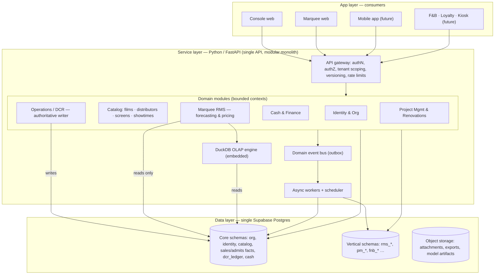

# Abhinaya Platform — Unified Backend Architecture

**A common data and service pool powering many cinema applications.**

Version 0.1 · 2026-06-21 · Owner: Nitin George · Status: Proposed (architecture direction)

---

## 1. Why this document exists

We are building two products against the same business: the **Console** (the operational system of record — DCRs, cash, finance, project management) and **Marquee** (a Revenue Management System — forecasting, occupancy modelling, dynamic pricing). Today they sit on two separate backends: the Console on Supabase Postgres with Deno Edge Functions, and Marquee on a Python service with a Neon Postgres database and DuckDB for analytics, fronted by Cloudflare Workers.

Two backends for one organisation's data is the inefficiency we want to remove. A cinema's admits, showtimes, distributor terms and cash are a single truth; an RMS is a decision layer that sits on top of that truth, not a separate world that re-imports it. This document defines a single platform — one data pool, one service layer, many apps — that is **modular, extensible, data-efficient and robust**, and is designed so that the third, fourth and tenth application we build is cheap to add rather than another silo.

The directional decisions captured here (made 2026-06-21): consolidate to **one Postgres** (Supabase as the single source of truth; retire Neon), consolidate the service layer to **Python/FastAPI**, and keep DuckDB as an *embedded analytical engine* rather than a second database.

---

## 2. Principles

The architecture is governed by a small number of rules that everything else follows from.

**One source of truth.** Every fact about the business is written in exactly one place and read everywhere else. Admits, showtimes, distributor terms, cash movements and DCR ledgers live once, in the core. No app keeps its own private copy of shared data.

**Bounded contexts, not a monolith of mud.** The platform is one deployable service made of clearly separated domain modules (Identity, Catalog, Operations/DCR, Cash & Finance, RMS, Project Management). Modules own their own tables and talk to each other through internal service interfaces, never by reaching into each other's tables. This keeps a modular monolith's simplicity while preserving the option to split a module into its own service later without a rewrite.

**The API is the contract.** Apps never touch the database directly across context lines. They call versioned, permission-scoped endpoints. The shape of an endpoint is a promise we keep; the schema behind it is free to change.

**Permissions live at the service layer, with RLS as a second wall.** Who can read and who can write is enforced in the API for every endpoint, and Postgres Row-Level Security enforces tenant isolation again at the database. Two walls, because one of them protects real money.

**DCR-derived data is read-only to everyone except the Console.** The DCR math is a legal contract and is locked. The Operations module is the only authoritative writer of admits and DCR ledgers; Marquee and every future app consume it read-only and write only their own artifacts (forecasts, price recommendations, scenarios).

**Deploy independence is the test of good boundaries.** We should be able to ship a change to Marquee without redeploying or risking the Console, and vice versa. If a change to one forces a change to the other, the shared layer has leaked and the boundary is wrong.

**Multi-tenant from day one.** Even though Abhinaya is the first and currently only tenant, every table carries an `org_id` and every query is tenant-scoped. Retrofitting tenancy later is the expensive mistake we are deliberately avoiding.

**Staging and production parity.** Every data-bound feature works in both environments, with the environment detected at runtime, never hard-coded.

---

## 3. The layered model

The platform is three layers. Apps sit on top, a single Python service layer in the middle, and one Postgres database with an embedded analytical engine at the bottom.

### 3.1 Data layer — one Postgres

A single managed Postgres instance (Supabase) is the source of truth for the whole platform. We retire Neon and fold Marquee's data into it. Supabase gives us managed Postgres, authentication (GoTrue), object storage, point-in-time recovery and Realtime out of the box; we keep all of those and use Postgres itself as the spine.

Inside that one database we use **schemas as the boundary between contexts** rather than separate databases:

- **Core schemas** hold the shared truth every app needs: `org` (tenants, users, roles), `catalog` (films, distributors, screens, showtimes, release calendar), `sales` (the admits and ticket fact tables, F&B lines), `dcr` (the locked DCR ledger), `cash` (cash movements, settlements, finance).
- **Vertical schemas** hold data that belongs to exactly one application: `rms` (engineered features, forecasts, price recommendations, model runs, backtests), `pm` (projects, checklists, renovations), and future ones like `fnb`, `loyalty`, `kiosk`.

Heavy analytical work does not run as ad-hoc scans against the operational tables. DuckDB runs **embedded inside the Python analytics module**, reading from Postgres (or from columnar exports/materialized views) to do the OLS regressions, occupancy curves, slot-mix and backtests that Marquee needs, then writing only its results back into the `rms` schema. This preserves the analytical speed that Neon+DuckDB gave Marquee without paying for a second database or a second copy of the truth.

### 3.2 Service layer — one Python service, many modules

A single FastAPI application is the common pool of capabilities every app calls. It is a **modular monolith**: one deployable, internally divided into the domain modules above, each owning its tables and exposing a clean internal interface. The gateway in front handles authentication, authorization, tenant scoping, API versioning and rate limiting once, for all modules.

This is where "each app calls the APIs it needs" becomes real and safe. An endpoint such as `GET /v1/shows/{id}/occupancy` or `POST /v1/rms/price-recommendations` declares exactly who may read and who may write. The Console holds write scope on Operations and Cash; Marquee holds read scope on those plus write scope on `rms` only. A new app is just a new client with a new scope set — it cannot increase risk to the existing apps because it can only reach what its scopes allow.

Background and scheduled work (digests, nightly model builds, settlement projections, the jobs that pg_cron runs today) move to an **async worker pool with a scheduler** (Arq or Celery on Redis), triggered both by time and by domain events. Long or expensive operations never block an API request.

### 3.3 App layer — thin consumers

Each frontend is a consumer of the same API: the Console web app, the Marquee web app, a future mobile app, future F&B/loyalty/kiosk surfaces. They hold no business logic that belongs in the core; they render and orchestrate calls to the service layer. New surfaces are additive and do not touch the others.

---

## 4. The shared data model

The value of the platform is the core domain model. Get this right and every future app is a thin layer on top; get it wrong and each app pays the tax forever.

The **core** is organised around the cinema's real-world facts. An *organisation* owns *screens*; *films* are supplied by *distributors* under *terms*; a *showtime* places a film on a screen at a time; a *show* produces *admits* and *F&B sales* (the fact tables) and a *DCR ledger* entry; *cash movements* and *settlements* track the money. These are normalised, immutable-where-they-should-be (facts are append-only and corrected by reversing entries, never silently overwritten), and every row is stamped with `org_id` and audit timestamps.

The **fact tables** — admits per show, ticket lines, F&B lines — are the analytical heart. They are the grain Marquee learns from (occupancy at the seat/show/slot level) and the grain the Console reports on (DCRs, daily collections). Because they are shared, Marquee starts with real historical demand on day one with zero ingestion — which is precisely the moat the platform exists to create.

**Vertical schemas** extend the core without polluting it. Marquee's `rms` schema holds engineered features, model runs, forecasts, price recommendations and backtests — all of which *reference* core facts but are owned by Marquee and never written by anyone else. The Console's `pm` schema holds projects and renovations. A future loyalty app would add a `loyalty` schema referencing `org` and `sales`, and nothing in the core or in Marquee needs to change for it to exist.

The contract between core and verticals is one-directional: **verticals depend on the core; the core never depends on a vertical.** That is what lets us add and remove verticals freely.

---

## 5. Tech stack

| Concern | Choice | Why |
|---|---|---|
| Database | **Supabase Postgres** (single instance, schema-separated) | One source of truth; RLS, Auth, Storage, PITR, Realtime included; Console already runs real money on it |
| Analytical compute | **DuckDB, embedded in the Python analytics module** | Columnar OLAP speed for OLS/forecast/backtest without a second database |
| Service layer | **Python 3.12 + FastAPI**, modular monolith | One language; Python is strongest for the statistical/ML models Marquee already has; async, typed, fast |
| Data access | **SQLAlchemy 2.x + Alembic** (single migrations source) | Typed models, one migration history for the whole platform, CI auto-applies |
| AuthN | **Supabase Auth (GoTrue), JWT** | Already in use; standard tokens the FastAPI gateway verifies |
| AuthZ | **Scope/claim-based checks in the gateway + Postgres RLS** | Defense in depth; permissions per endpoint, tenant isolation at the DB |
| Background jobs | **Arq (or Celery) on Redis** + scheduler | Replaces pg_cron for app-level jobs; event- and time-triggered |
| Eventing | **Transactional outbox** in Postgres → workers | Reliable domain events without a separate broker at first; upgrade to a broker if needed |
| API contract | **OpenAPI (auto-generated by FastAPI), versioned `/v1`** | Typed clients for every frontend, contract tests |
| Caching | **Redis** for hot reads and computed aggregates | Cuts repeated analytical reads; the view header reload stays cheap |
| Frontends | **React + Vite + Tailwind** (Console & Marquee), Cloudflare for edge/static | Keep what works; both are pure API consumers |
| Hosting (service) | **Containerised FastAPI** (Render/Fly/Cloud Run) | Marquee's Python already deploys on Render; reuse the pattern |
| Observability | **Structured logs + OpenTelemetry traces + Sentry** | One trace across gateway → module → DB; tenant-tagged |
| CI/CD | **GitHub Actions**, migrations applied on merge (staging→staging DB, main→prod DB) | Matches existing workflow; single migrations source |

---

## 6. Modularity and extensibility — how the tenth app stays cheap

The platform is designed so that adding capability is additive, never invasive. There are exactly four ways the system grows, and all of them are cheap:

**A new application** is a new API client with its own scope set and, if it owns data, its own vertical schema. It reads the core it needs and writes only its own tables. The mobile app, an F&B ordering surface, a loyalty programme, a kiosk — each is this pattern. None of them touches the others.

**A new capability inside an existing domain** is a new endpoint and, where needed, a new table inside that module's schema, behind a new scope. Existing endpoints keep working because the API is versioned and additive.

**A new analytical model** in Marquee is a new module under the RMS engine (the existing `models/` structure — forecast, pricing, occupancy, slot-mix, OLS, backtest — is exactly this shape) that reads facts and writes to `rms`. The locked Console math is never touched.

**A new integration** (Zoho, Tally, a payment gateway, a distributor feed) is an adapter at the edge of the service layer that maps an external system to core endpoints. Integrations are quarantined in their own module so a vendor's API change never ripples into the core.

Three mechanisms make this safe: **API versioning** (old clients keep working while new ones adopt `/v2`), **domain events** (modules react to things like "show finalized" or "DCR posted" without being wired directly to each other), and the **core-never-depends-on-a-vertical** rule (so a vertical can be added or deleted without a core migration).

---

## 7. Data efficiency

Data efficiency here means: store each fact once, compute heavy things in the right engine, and never make an app pay to re-derive what another app already produced.

Facts are **normalised and append-only** at a fine grain (show/seat/slot), so there is no duplication and corrections are auditable reversals rather than overwrites. Reporting and modelling read from **materialized views and pre-aggregated rollups** (daily collections, occupancy curves, ASP by class/slot) that are refreshed on a schedule or on the relevant domain event, so dashboards and forecasts read cheap summaries instead of scanning raw facts. The genuinely heavy analytics — regressions, backtests, scenario sweeps — run in **DuckDB's columnar engine** over exports of those facts, which is an order of magnitude faster than row-store scans and keeps that load off the operational tables. As volume grows, the large fact tables **partition by time and org**, keeping queries fast and archival cheap. Hot, repeatedly-read results are **cached in Redis** with event-based invalidation.

The compounding benefit is the one that motivates the whole platform: because Marquee reads the same facts the Console already captured, the most expensive input to an RMS — clean historical demand at the right grain — costs nothing to produce. Every new app inherits that same advantage.

---

## 8. Robustness

The platform protects real money and a legally-binding DCR, so robustness is not optional.

**Tenant isolation** is enforced twice — scope checks in the gateway and RLS in Postgres — so a bug in one wall does not leak another tenant's data. **The DCR math stays locked**: the Operations module is the only writer, its calculations are covered by the existing test suite, and no other module can mutate admits or ledger entries. **Migrations are a single source** (`supabase/migrations/`, one Alembic history) applied automatically by CI to the staging DB on a staging merge and the prod DB on a main merge, so the two environments never drift. **Facts are append-only with an audit trail**, so every figure is traceable and corrections are visible. **Idempotency keys** on writes and the **transactional outbox** for events mean a retried request or a crashed worker cannot double-post a payment or a ledger entry. **Observability** is a single trace from gateway through module to database, tagged by tenant, with Sentry on errors, so a problem is diagnosable in production. **Backups and point-in-time recovery** come from Supabase; we test restores. Each domain module has its own test suite (Marquee's `tests/` already covers ingest, models, pricing, forecast, backtest), and contract tests guard the public API so a breaking change is caught before a frontend does.

---

## 9. Trade-offs we are accepting

The chosen path — one Postgres, one language — is deliberately the simplest mental model, and it costs us a few things worth naming honestly.

Retiring Neon means we **give up Neon's database branching** (cheap per-PR database copies) and its serverless autoscaling. We mitigate this with Supabase branching where available and seeded ephemeral test schemas in CI. Folding analytics into one database means we must **protect the operational tables from analytical load**; the DuckDB-over-exports pattern and read replicas (if needed later) are how we do that. Consolidating compute to Python means we **rebuild the conveniences the Deno Edge Functions and pg_cron gave the Console** (they become FastAPI endpoints and worker jobs) — a real migration cost, paid once, in exchange for a single language and a single deployment story. And a **modular monolith is one deployable**, so a bad deploy can in principle affect every module; we accept this for the operational simplicity at our scale, and the module boundaries are drawn so that any single module can be extracted into its own service later without a rewrite if that trade-off ever flips.

None of these undermines the core thesis: one data pool, one service layer, permission-scoped APIs, and verticals that depend on the core but never on each other.

---

## 10. From here to there

This document is the target, not a migration plan, but the shape of the path is worth stating so the target is believable. The core schemas and the FastAPI gateway are stood up first against the existing Supabase database, with the Console continuing to run unchanged. Marquee's Python service is then re-pointed from Neon to the Supabase database and its tables become the `rms` schema, with DuckDB reading from Supabase instead of Neon. The Console's Deno Edge Functions and pg_cron jobs are migrated module by module into FastAPI endpoints and worker jobs, behind the same scopes. At each step both products keep working, because the API contracts are stable and the data never moves twice. A phased roadmap with sequencing and risk can follow once this direction is approved.

---

*This is a living architecture document. Decisions of record should be promoted into numbered ADRs alongside Marquee's existing `docs/ADR/` entries.*
